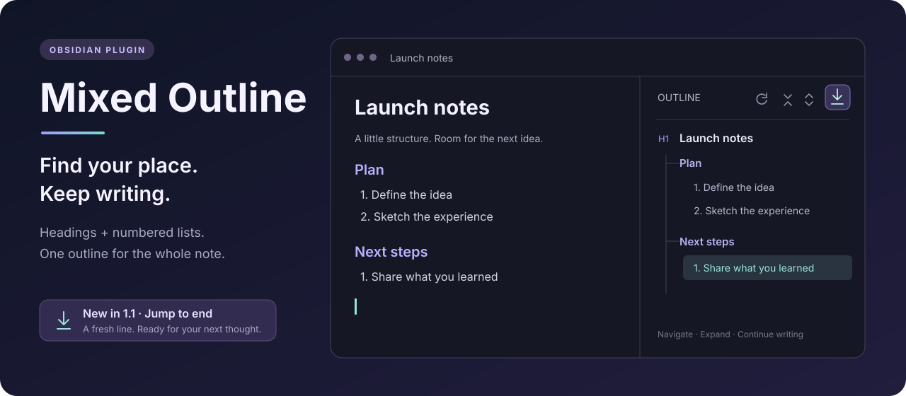

<p align="center">
  
</p>

<p align="center">
  <a href="https://github.com/hemashishi12/mixed-outline/releases/latest"></a>
  <a href="LICENSE"></a>
  
  
</p>

<p align="center">
  <b>Headings and numbered lists, together in one navigable outline.</b><br>
  Click anywhere in your note. Your outline follows.
</p>

<p align="center">
  <a href="#installation">Install</a> ·
  <a href="#follow-your-cursor">Follow your cursor</a> ·
  <a href="CHANGELOG.md">What's new</a> ·
  <a href="README.zh-CN.md">简体中文</a>
</p>

---

## Why Mixed Outline?

Your ideas do not always fit inside headings. Reading notes, project plans, study guides, and long drafts often carry their structure in numbered lists too. Mixed Outline brings both into a single sidebar tree, so you can navigate the way you actually write.

## What's new in 1.2.0

- **Follow your cursor immediately.** Clicking, using arrow keys, or editing expands and highlights the matching outline branch without waiting for a scroll. Enabled by default; turn off **Follow cursor / 跟随光标** to keep manual control.
- **Headings stay out of preceding lists.** A heading after a numbered list is now attached to its heading parent, even when heading levels are skipped. Collapsing that list no longer hides the heading.
- **Keep the active entry in view.** Outline scrolling no longer restores an old position over a newly highlighted entry.

Existing settings are preserved. See the [release notes](https://github.com/hemashishi12/mixed-outline/releases/tag/1.2.0) or [full changelog](CHANGELOG.md).

## Features

| Feature | What it does |
| --- | --- |
| **One connected outline** | Combines Markdown headings and numbered list items, including nested lists. |
| **Click to navigate** | Takes you to the matching line in the note. |
| **Follow your cursor** | Expands the current branch as you click, move the caret, or type. |
| **Jump to end ✨** | Moves to the bottom, focuses the editor, and leaves an empty line ready for writing. |
| **Follow your reading** | Optional scroll sync expands the current path and highlights your position. |
| **Keep the tree tidy** | Collapse or expand the outline with a single click. |
| **Stay up to date** | Refreshes as you edit or switch notes. |

The illustration above uses fictional sample content. No personal vault screenshots are included.

## Installation

### From Obsidian

1. Open **Settings → Community plugins → Browse**.
2. Search for **Mixed Outline**, install it, and enable it.
3. Click the **Open Mixed Outline** ribbon icon, or run **Mixed Outline: Open mixed outline** from the command palette.

Already installed? Open **Settings → Community plugins → Check for updates** and update Mixed Outline.

### Manual installation

Download `main.js`, `manifest.json`, and `styles.css` from the [latest release](https://github.com/hemashishi12/mixed-outline/releases/latest). Place all three in `<your-vault>/.obsidian/plugins/mixed-outline/`, reload Obsidian, and enable the plugin. Preserve `data.json` when upgrading; it contains your settings.

Requires **Obsidian 1.5.0+**. The plugin uses Obsidian and its bundled CodeMirror APIs, with no Node.js or Electron runtime dependencies. Desktop and mobile are declared supported; version 1.2.0 was verified in desktop Obsidian, while mobile and the minimum supported Obsidian version have not been separately tested.

## Follow your cursor

In **Live Preview** or **Source mode**, click a heading, numbered item, or paragraph. Mixed Outline highlights the corresponding entry, expands it and its ancestors, and collapses unrelated branches. Selecting a parent heading or list item reveals its direct children. Arrow keys and text edits work the same way; no scroll is required.

For ordinary paragraphs, the preceding heading or numbered item determines the current outline entry. Before the first entry, there is nothing to highlight.

**Follow cursor / 跟随光标** is on by default, including after upgrading. It is independent of **Auto sync to scroll position**, which is off by default. Enable scroll sync to follow the visible section while reading; in Reading view, scroll sync provides navigation because there is no editing cursor.

To expand and collapse the tree entirely by hand, turn both settings off.

## Jump to end

Click the **down arrow above a horizontal line**, the last button in the outline toolbar. Its tooltip is **跳转到最后 / Jump to end**.

The button brings the current note into editing mode, scrolls the final cursor position into view, and focuses the editor so you can start typing immediately.

- If the note ends with text, one newline is appended.
- If an empty final line already exists, the cursor moves there. Repeated clicks do not accumulate blank lines.
- Empty notes are ready to type into without inserting extra lines.
- Reading view switches to editing first. Live Preview and Source mode remain editable.
- Existing text, including selected text and the contents of a final list item, is preserved.

You can also run **Mixed Outline: Jump to end / 跳转到最后** from the command palette, or assign it a hotkey under **Settings → Hotkeys**. The toolbar button is disabled when no Markdown note is available.

## A small example

```markdown
# Launch notes
## Plan
1. Define the idea
2. Sketch the experience
   1. Keep the outline clear
   2. Make writing effortless
## Next steps
1. Share what you learned
```

The headings and numbered items appear together. Nested list items sit beneath their parent, and each entry links back to its source line.

### How headings and lists fit together

```markdown
# Project
1. First step
   1. Detail
### Next section
1. Next step
```

```text
Project
├─ 1. First step
│  └─ 1. Detail
└─ Next section
   └─ 1. Next step
```

A list belongs to the preceding heading. A later heading uses the heading hierarchy, never the preceding list as its parent. This also applies to skipped heading levels: `Next section` remains beside `First step`. A list before the first heading stays at the root alongside that heading.

Mixed Outline recognizes ATX headings (`#` through `######`) and ordered list markers such as `1.` or `2)`. It skips YAML frontmatter, fenced code blocks, unordered lists, and task lists. Ordered items nested inside hidden unordered or task lists are also omitted.

## Settings & commands

| Setting | Default | Purpose |
| --- | --- | --- |
| Show headings | On | Include Markdown headings. |
| Show ordered lists | On | Include numbered Markdown list items. |
| Strip Markdown formatting | On | Simplify inline formatting in outline labels. |
| Maximum item length | 160 | Limit label length, from 20 to 500 characters. |
| Open on startup | Off | Open the sidebar when Obsidian starts. |
| Follow cursor / 跟随光标 | On | Immediately highlight and expand the cursor's entry and its ancestors. |
| Auto sync to scroll position | Off | Follow the visible section, expanding its ancestors and collapsing unrelated branches. |

Available commands: **Open mixed outline**, **Refresh mixed outline**, **Jump to end / 跳转到最后**, and **Toggle auto sync outline to scroll position**.

## Privacy

Mixed Outline processes note content locally. It makes no network requests, collects no telemetry, and needs no account. Its settings are stored in the vault's plugin `data.json`. Jump to end edits only the targeted note and only appends a newline when needed.

## Development

This is a small, directly editable JavaScript plugin. **There is no build step or dependency installation.**

```sh
git clone https://github.com/hemashishi12/mixed-outline.git
cd mixed-outline
node --check main.js
node --test
```

Use Node.js 18+ for the tests. Copy the three plugin files into a development vault and reload the plugin to try changes.

| File | Purpose |
| --- | --- |
| `main.js` | Plugin lifecycle, parser, outline UI, navigation, and settings. |
| `styles.css` | Theme-aware sidebar styling. |
| `manifest.json` | Plugin identity, version, and minimum Obsidian version. |
| `versions.json` | Release compatibility mapping. |
| `test/` | Navigation, cursor synchronization, and hierarchy regression tests using Node's built-in test runner. |
| `tests/hierarchy.cjs` | Reusable checks for 37 heading/list hierarchy cases, scroll paths, and numbering. |

Implementation notes:

- Reading view must switch to `source` view state before placing an editable caret. This state covers both Source mode and Live Preview.
- Use `editor.replaceRange()` at the final position to preserve selected text and normal undo history. Do not rewrite the whole note or simulate Enter, which can continue a list.
- Recheck the target file after asynchronous view changes, and ignore overlapping invocations.
- Clicking the sidebar can change the active pane. Resolve the current Markdown view using the existing active/recent-note tracking.
- For Windows installations where `obsidian` is not on PATH, invoke `Obsidian.com` in the installation directory to use CLI diagnostics. Background-window timers can be throttled during live checks.
- Heading levels and list depths share `effectiveLevel`, but cannot be compared blindly: a new heading must first pop list nodes from the ancestor stack.
- Register cursor tracking through `registerEditorExtension()` and CodeMirror's `updateListener`. In the tested Obsidian version, `editorInfoField` is the Markdown view itself; accept a wrapped `.view` too. Coalesce selection changes in a microtask after the editor update, and ignore inactive editors.
- Cursor movement may scroll the editor. Cancel pending scroll sync and briefly suppress incidental scroll so it cannot replace the selected line with the viewport's first line. Do not restore the outline's old scroll position after revealing an active entry.

To release: update `manifest.json`, add the version to `versions.json`, and publish a GitHub release with an exact numeric tag such as `1.2.0` (**no `v` prefix**). Attach `main.js`, `manifest.json`, and `styles.css`. The existing Obsidian community catalog entry points at this repository; [normal updates do not require another catalog submission](https://docs.obsidian.md/plugins/releasing/submit-plugin).

## Feedback & license

[Report a bug or suggest an improvement](https://github.com/hemashishi12/mixed-outline/issues). Include your Obsidian version, plugin version, and a minimal example using non-private sample text.

Released under the [MIT License](LICENSE).
